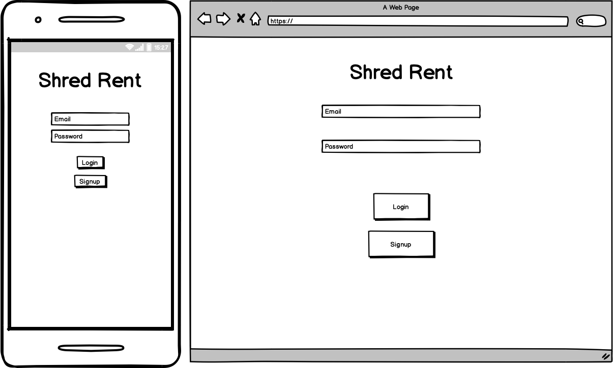
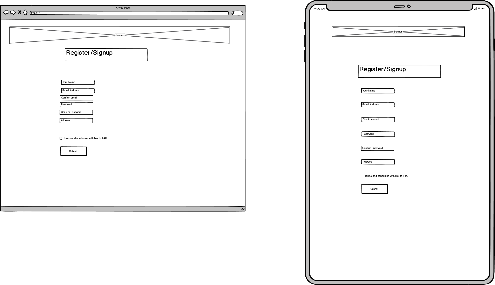
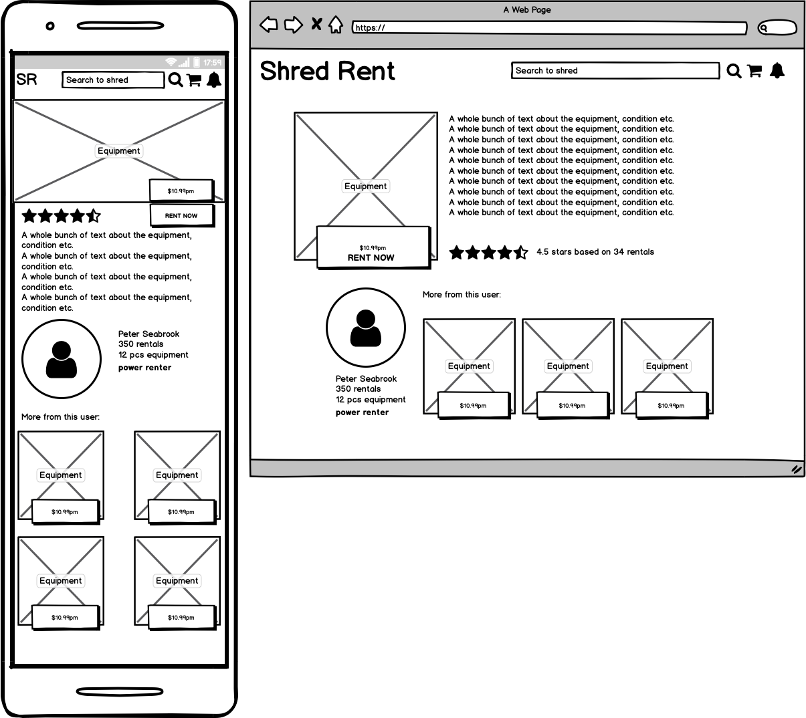
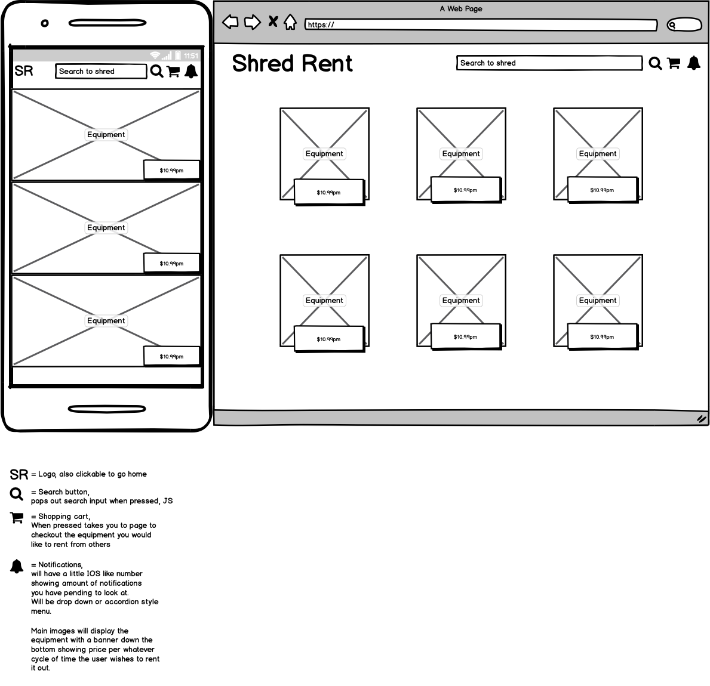

# SSB

## Gym Equipment Sharing

This is a web application that is designed with the primary person of connecting people with 
gym equipment they are no longer using with people who wish to hire the equipment. The target 
for this shall be people requiring specific gear. People who want to take action on their health
at home without the outlay. Or people just looking to try different things to see what works for them.
All payments and hiring shall be done through the application. 

### Minimum Features

* Log in / Log out for
* Upload Profile /create
* Add equipment
* Search for equipment
* Hire equipment

## Wireframes

### Home page - Log in / Search for equipment / Sign up

basic log in screen with a header. An appropriate background picture etc

### Sign up page - fields to be filled out

Page to sign up and register your information. More fields shall be added. 
But this will capture basic user information for storage. Implementation might 
be better as a pop up window

### Profile page upload photos change information, dashboard/summary 

Page show user profile as well as edit option
This page shall also have a dashboard showing equipment currently on hire/to be hired
(hired equipment shall be grayed out and duration remaining for hire shown, equipment for hire
shall be clear)

Second dashboard shall show equipment on hire with monthly cost as well as duration remaining
Hires shall continue until equipment is returned. Incentives for longer hire durations can be included

### Product Page - User reviews, owner information, other products from this user, details about the product

Page shows equipment to be hired with a hire now button. Also shows other equipment from that user and has an equipment 
star rating information on the equipment as well as rates for the equipment. Blurb on the equipment as well as photo's

### Search Page - After the user searches for equipment the following information is shown

Users can see the equipment with photos as well as rates. From here they can get more info regarding the equipment, 
add to cart and receive notifications (equipment availability, hires running out etc etc )

upload equipment button, search field at top.
Search results/filters/fields
Individual item summary page
checkout page
    
 

*Some ideas people can search for equipment from the start page, option to login in once they find stuff.
or can log in from the start.

Base Idea:

Someone can upload gym equipment for hire
Someone can hire gym equipment that has been uploaded for a period of time.

Other options.

